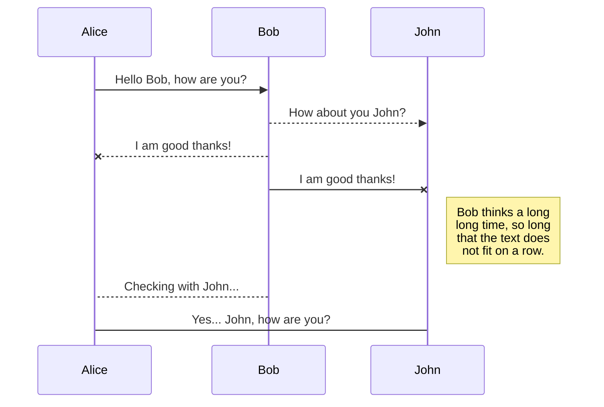
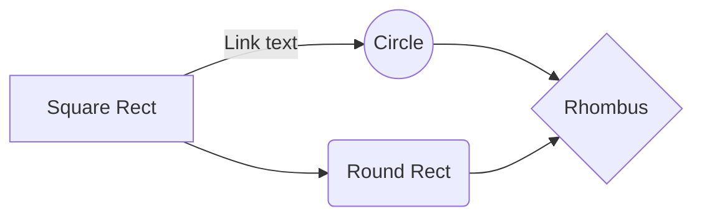

# Database and Script Structure

	
<h2>IBM RPA - IBM Robotic Process Automation</h2> 

<p align="center">
   
 <!--  -->
</p>

## Estrutura Data Base 

Como a ideia deste primeiro material é ter algo simples e de facil implementação para novos empresas que estão aderindo ao IBM RPA, estaremos utilizando apenas uma tabela de log. Está tabela pode ser utilizada por mais de um projeto/script por conta das colunas para aplicar filtros.
Abaixo esta a query de criação da tabela, 

```
CREATE TABLE IBMRPA_LOG (
    ID              INTEGER       PRIMARY KEY AUTOINCREMENT,		/* identificador do registro */
    LOGDATE         DATETIME      NOT NULL,				/* data e hora do registro*/
    PROJECT         INTEGER       NOT NULL,				/* nome do projeto*/
    SCRIPT          INTEGER       NOT NULL,				/* nome do script*/
    LOGTYPE         VARCHAR       NOT NULL,				/* tipo do log INFO/WARN/ERROR*/
    REGISTERID      VARCHAR,						/* identificador do registro que esta sendo executado*/
    MESSAGE         VARCHAR (255) NOT NULL,				/* mensagem para ser registrada*/
    ERRORSUBROUTINE VARCHAR,						/* Em caso de erro: A rotina que apresentou erro*/
    ERRORLINE       INTEGER,						/* Em caso de erro: A linha que apresentou erro*/
    ERRORMESSAGE    VARCHAR,						/* Em caso de erro: A mensagem do erro*/
    PATHSCREENSHOT  VARCHAR						/* Em caso de erro: O caminho que foi salvo o screenshot*/
);
```

## Estrutura do Script  

Temos a rotina "RegisteringLog" que é responsável por registrar todas mensagem no DB, basicamente obtem a data/hora atual, conecta no DB e executa a query com os dados recebidos na chamada da sub rotina e desconecta do DB.

<h5><script></h5>

```
beginSub --name __RegisteringLog
	replaceText --texttoparse "${_logMessage}" --textpattern "\'" _logMessage=value
	getCurrentDateAndTime --localorutc "LocalTime" dateTimeNow=value
	sqliteConnect --connectionString "Data Source=${pathDataBase};Version=3;" conBd=connection success=success
	sqlExecute --connection ${conBd} --statement "INSERT INTO IBMRPA_LOG (\r\n   LOGDATE, PROJECT, SCRIPT,\r\n   LOGTYPE,REGISTERID,MESSAGE,\r\n   ERRORSUBROUTINE,ERRORLINE,\r\n   ERRORMESSAGE,PATHSCREENSHOT\r\n)\r\nVALUES (\r\n   \'${dateTimeNow}\',\'${_project}\',\'${_script}\',\r\n   \'${_logType}\',\'${_registerId}\',\'${_logMessage}\',\r\n   \'${_logErrorSubRoutine}\',\'${_logErrorLine}\',\r\n   \'${_logErrorMessage}\',\'${_logPathScreenshot}\'\r\n);" insertedRows=value
	sqlDisconnect --connection ${conBd}
endSub
```
	
<h5><designer></h5>
	


Nesta imagem podemos visualizar a query e as variaveis do script que serão inseridos na tabela.

	


	
- dateTimeNow > Obtem o valor toda a vez que é executado a rotina
- _project and _script > Definido na rotina Initializing

	

- _logType, _registerId and _logMessage > Informado no comando 'Run SubRoutine(goSub)'

	

- _logErrorSubRoutine, _logErrorLine, _logErrorMessage, and _logPathScreenshot > Informado no comando 'Run SubRoutine(goSub)' da rotina __ErrorHandling

	
	
	
	
	


And this will produce a flow chart:


